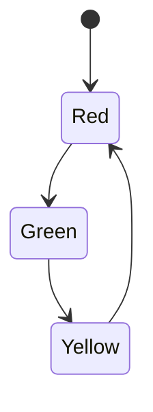
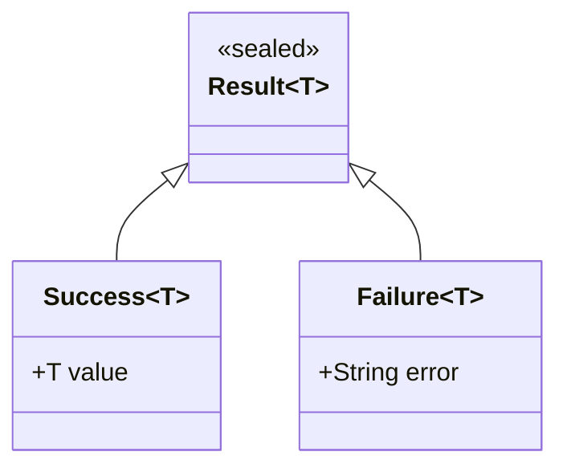
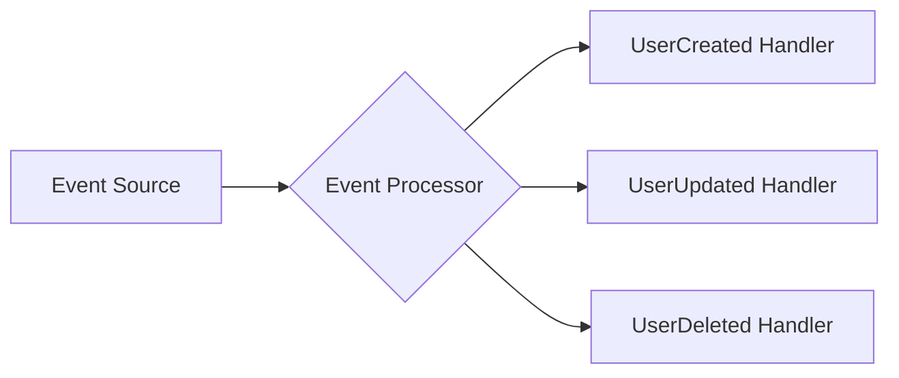
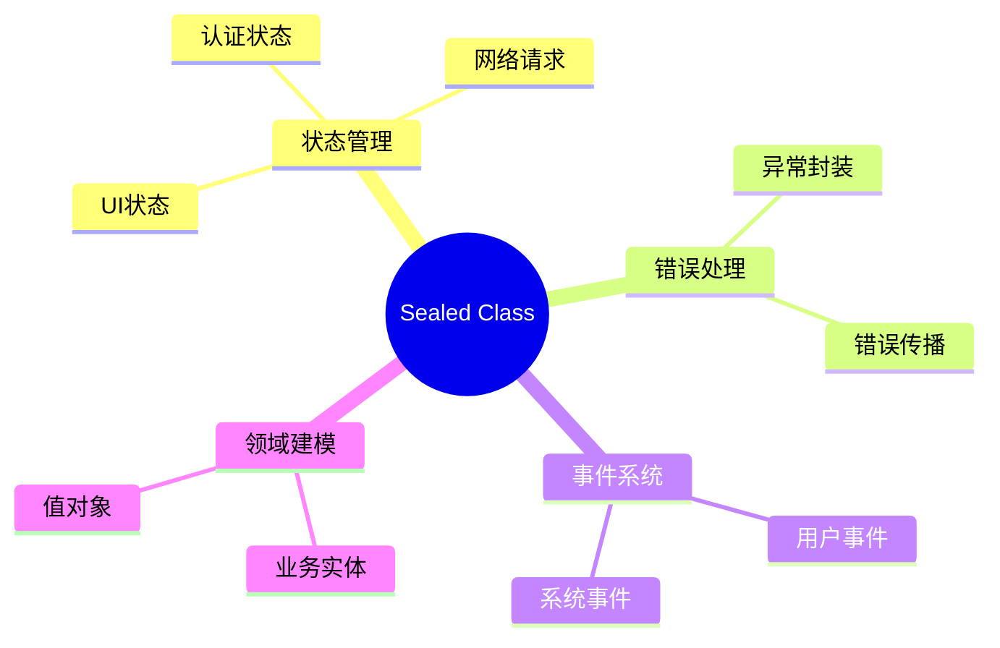

在 Flutter 应用开发中,我们经常需要处理多种状态和类型的数据。例如,一个网络请求可能处于加载中、成功、失败等不同状态。传统的做法可能使用枚举或继承体系来处理这些情况,但往往会面临类型安全和维护性的挑战。

Dart 3.0 引入的 sealed class 和增强的模式匹配特性,为这类问题提供了更优雅的解决方案。其实我们已经在前面的文章[《Flutter 优化 API 错误响应：Result 模式实践指南》](https://zhangwen.site/blog/flutter-result-pattern) 中提过 sealed class ，并给出了具体的实现方式，但是没有针对这个新语法做更多的深入探索。本文将延续这一话题，让我们通过实际案例来更加深入理解这些特性。

<!-- truncate -->

**版本要求**

- Dart SDK: 3.0 或更高版本
- Flutter: 3.10 或更高版本

## Sealed Class 基础

sealed class 是一种特殊的抽象类,它限定了可能的子类集合。这种限制在编译时就能确保所有可能的类型都被正确处理。让我们看一个实际的例子:

```dart
sealed class ApiResponse {
  const ApiResponse();
}

final class Loading extends ApiResponse {
  final DateTime startTime;
  const Loading({required this.startTime});
}

final class Success extends ApiResponse {
  final dynamic data;
  final DateTime timestamp;
  const Success({required this.data, required this.timestamp});
}

final class Failure extends ApiResponse {
  final String message;
  final int statusCode;
  final DateTime timestamp;
  const Failure({
    required this.message, 
    required this.statusCode, 
    required this.timestamp
  });
}
```

这个设计有几个关键优点:
1. 类型安全: 所有 ApiResponse 的可能类型都在编译时确定
2. 穷尽性检查: 编译器确保处理所有可能的情况
3. 封闭性: 防止在其他文件中创建新的子类

## 模式匹配详解

Dart 3.0 引入的模式匹配让我们能更优雅地处理 sealed class。以下展示两种主要的使用方式:

### 1. switch-case 模式

```dart
String handleResponse(ApiResponse response) => switch(response) {
  Loading(startTime: var time) => 
    'Loading since ${time.toString()}',
  
  Success(data: final d, timestamp: var ts) => 
    'Success: $d at ${ts.toString()}',
  
  Failure(message: var msg, statusCode: var code) => 
    'Error $code: $msg'
};
```

### 2. if-case 模式

```dart
void showResponseUI(ApiResponse response) {
  if (response case Loading()) {
    showLoadingSpinner();
  } else if (response case Success(data: var data)) {
    showData(data);
  } else if (response case Failure(message: var msg)) {
    showError(msg);
  }
}
```

### 实战示例: API 客户端实现

让我们实现一个完整的 API 客户端示例:

```dart
class ApiClient {
  Future<ApiResponse> fetchData() async {
    try {
      final startTime = DateTime.now();
      // 发出加载状态
      yield Loading(startTime: startTime);
      
      final response = await http.get(Uri.parse('https://api.example.com/data'));
      
      if (response.statusCode == 200) {
        return Success(
          data: jsonDecode(response.body),
          timestamp: DateTime.now()
        );
      } else {
        return Failure(
          message: 'Request failed',
          statusCode: response.statusCode,
          timestamp: DateTime.now()
        );
      }
    } catch (e) {
      return Failure(
        message: e.toString(),
        statusCode: -1,
        timestamp: DateTime.now()
      );
    }
  }
}
```

## 传统方案对比

### 枚举方案

```dart
enum ApiState { loading, success, failure }

class ApiResult {
  final ApiState state;
  final dynamic data;
  final String? error;
  
  ApiResult({
    required this.state,
    this.data,
    this.error,
  });
}
```
问题:

- 类型不安全,data 和 error 可能同时为 null
- 状态和数据耦合在一起
- 难以添加状态特有的属性
- 运行时可能出现状态和数据不一致


### 传统继承方案
```dart
abstract class ApiResult {
  const ApiResult();
}

class ApiSuccess extends ApiResult {
  final dynamic data;
  ApiSuccess(this.data);
}

class ApiError extends ApiResult {
  final String message;
  ApiError(this.message);
}
```

问题:
- 无法在编译时保证子类的完整性
- 其他开发者可以随意添加新的子类
- 需要手动处理所有类型检查
- switch 语句不会强制检查所有情况

## 高级应用场景

### 嵌套 Sealed Classes

```dart
sealed class NetworkEvent {}

sealed class AuthEvent extends NetworkEvent {
  final DateTime timestamp;
  const AuthEvent(this.timestamp);
}

final class LoginSuccess extends AuthEvent {
  final String token;
  const LoginSuccess(this.token, DateTime timestamp) : super(timestamp);
}

final class LoginFailure extends AuthEvent {
  final String reason;
  const LoginFailure(this.reason, DateTime timestamp) : super(timestamp);
}

final class NetworkError extends NetworkEvent {
  final String message;
  const NetworkError(this.message);
}

// 使用嵌套模式匹配
String handleNetworkEvent(NetworkEvent event) => switch(event) {
  AuthEvent() => switch(event) {
    LoginSuccess(token: var t) => 'Logged in: $t',
    LoginFailure(reason: var r) => 'Login failed: $r',
  },
  NetworkError(message: var m) => 'Network error: $m',
};
```

### 状态机实现




```dart
sealed class TrafficLight {
  final Duration duration;
  const TrafficLight(this.duration);
  
  TrafficLight next();
}

final class RedLight extends TrafficLight {
  const RedLight() : super(const Duration(seconds: 30));
  
  @override
  TrafficLight next() => const GreenLight();
}

final class YellowLight extends TrafficLight {
  const YellowLight() : super(const Duration(seconds: 3));
  
  @override
  TrafficLight next() => const RedLight();
}

final class GreenLight extends TrafficLight {
  const GreenLight() : super(const Duration(seconds: 20));
  
  @override
  TrafficLight next() => const YellowLight();
}
```

### 泛型支持



```dart
sealed class Result<T> {
  const Result();
}

final class Success<T> extends Result<T> {
  final T value;
  const Success(this.value);
}

final class Failure<T> extends Result<T> {
  final String error;
  const Failure(this.error);
}
```

### 事件驱动架构



```dart
sealed class UserEvent {}

final class UserCreated extends UserEvent {
  final String userId;
  final DateTime createdAt;
  const UserCreated(this.userId, this.createdAt);
}

final class UserUpdated extends UserEvent {
  final String userId;
  final Map<String, dynamic> changes;
  const UserUpdated(this.userId, this.changes);
}

final class UserDeleted extends UserEvent {
  final String userId;
  final String reason;
  const UserDeleted(this.userId, this.reason);
}

class EventProcessor {
  void processEvent(UserEvent event) => switch(event) {
    UserCreated(userId: var id, createdAt: var time) => 
      logUserCreation(id, time),
    UserUpdated(userId: var id, changes: var changes) => 
      applyUserChanges(id, changes),
    UserDeleted(userId: var id, reason: var reason) => 
      handleUserDeletion(id, reason),
  };
}
```
###  响应式编程集成

```dart
abstract class BlocState {}

sealed class DataState<T> extends BlocState {
  const DataState();
}

final class Initial<T> extends DataState<T> {
  const Initial();
}

final class Loading<T> extends DataState<T> {
  final T? previousData;
  const Loading([this.previousData]);
}

final class Success<T> extends DataState<T> {
  final T data;
  const Success(this.data);
}

final class Error<T> extends DataState<T> {
  final String message;
  final T? previousData;
  const Error(this.message, [this.previousData]);
}

// 在 StreamBuilder 中使用
Widget buildState<T>(DataState<T> state) => switch(state) {
  Initial<T>() => const LoadingPlaceholder(),
  Loading<T>(previousData: var data) => 
    LoadingOverlay(child: DataWidget(data: data)),
  Success<T>(data: var d) => DataWidget(data: d),
  Error<T>(message: var msg, previousData: var data) => 
    ErrorWidget(message: msg, fallbackData: data),
};
```

这些高级用法展示了 sealed class 在复杂系统中的强大能力:
- 类型安全的状态管理
- 可组合的事件处理
- 清晰的领域模型
- 灵活的泛型支持
- 优雅的模式匹配

## 性能考量

sealed class 的性能影响主要体现在以下几个方面:

1. 编译时:
- 模式匹配的穷尽性检查会增加编译时间
- 但这个开销在实际项目中可以忽略不计

2. 运行时:
- switch 表达式被编译为高效的跳转表
- 相比传统的 instanceof 检查更高效
- 内存占用与普通类继承相同

## 最佳实践

1. 状态建模:
- 使用 sealed class 对有限状态集合进行建模
- 确保状态之间的转换是显式的和类型安全的

2. 错误处理:
- 在 Failure 类中包含足够的错误信息
- 考虑添加堆栈跟踪以便调试

3. 测试策略:
- 为每个状态编写单元测试
- 测试状态转换的边界情况
- 验证错误处理逻辑



## 总结

sealed class 结合模式匹配为 Dart 开发带来了更强的类型安全性和更清晰的代码结构。通过本文的示例和最佳实践,您应该能够在实际项目中有效地运用这些特性。建议从小范围试点开始,逐步在更多场景中应用这种模式。

## 参考资源

1. [Dart 语言规范](https://dart.dev/language)
2. [Flutter 官方文档](https://flutter.dev/docs)
3. [Effective Dart](https://dart.dev/effective-dart)
