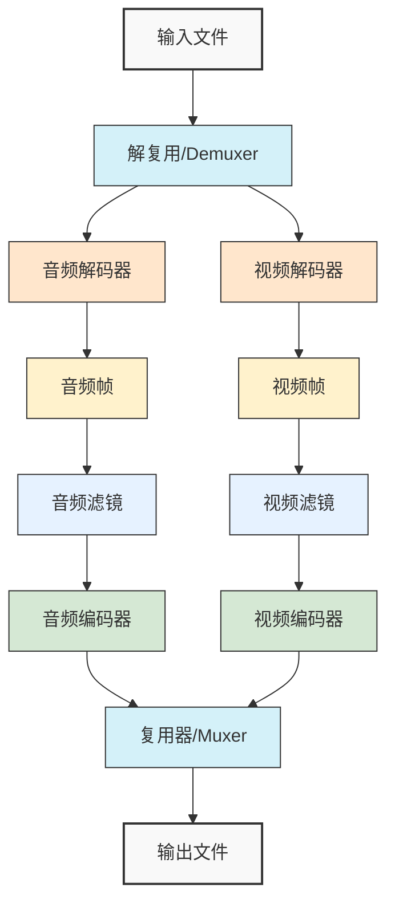

## 引言与背景

近几年，短视频应用的迅猛发展和普及为 iOS 开发者带来了前所未有的挑战，尤其是高效、专业的音视频处理成为 iOS 开发中不可或缺的一环。

> 根据中国互联网络信息中心（CNNIC）发布第 53 次《中国互联网络发展状况统计报告》，截至 2023 年 12 月，我国网络视频用户规模达 10.67 亿人，占网民整体的 97.7%。其中短视频用户规模达 10.53 亿人，较 2022 年 12 月增长 4145 万人，占网民整体的 96.4%。中国短视频用户规模持续增长，且占整体网民比例逐年提高，显示出短视频已经成为中国网民日常娱乐和信息获取的重要方式。我国短视频用户规模占比最大的是第一梯队的抖音、快手、视频号，占比为 70.04；其次是第二梯队微博、小红书、西瓜视频、B 站等，占比为 25.86%。海外市场中，TikTok 占据 40%的短视频平台市场份额，YouTube Shorts 和 Instagram Reels 各占 20%。

在众多音视频处理工具中，FFmpeg 以其开源、跨平台的特性脱颖而出。它支持几乎所有主流编解码器（如 H.264、H.265），拥有强大的滤镜系统，特别适合 iOS 平台上的短视频剪辑应用开发。本文将从开发需求出发，深入探讨 FFmpeg 在 iOS 平台上的应用，结合实际场景和代码示例，展示其如何助力开发者应对各种挑战。

## 一、容器：灵活处理音视频文件

短视频剪辑软件的起点是用户导入的视频文件，这些文件可能采用 MP4、MOV、AVI 等不同容器格式。FFmpeg 的`libavformat`库提供了强大的解复用（demuxing，从容器中分离出音视频流）和复用（muxing，将音视频流封装到容器中）能力，支持几乎所有主流容器格式，让开发者能够以统一的方式处理各种格式文件。

下面是一个使用 FFmpeg 打开 MP4 文件并提取流信息的示例：

```c
#include <libavformat/avformat.h>

int open_video_file(const char *file_path) {
    // 分配格式上下文
    AVFormatContext *fmt_ctx = avformat_alloc_context();
    if (!fmt_ctx) {
        fprintf(stderr, "分配AVFormatContext失败\n");
        return -1;
    }

    // 打开输入文件
    int ret = avformat_open_input(&fmt_ctx, file_path, NULL, NULL);
    if (ret < 0) {
        char errbuf[128];
        av_strerror(ret, errbuf, sizeof(errbuf));
        fprintf(stderr, "打开文件失败: %s\n", errbuf);
        avformat_free_context(fmt_ctx);
        return ret;
    }

    // 获取流信息
    ret = avformat_find_stream_info(fmt_ctx, NULL);
    if (ret < 0) {
        fprintf(stderr, "获取流信息失败\n");
        avformat_close_input(&fmt_ctx);
        return ret;
    }

    // 打印流信息（调试用）
    av_dump_format(fmt_ctx, 0, file_path, 0);

    // 查找最佳视频流
    int video_stream_idx = av_find_best_stream(fmt_ctx, AVMEDIA_TYPE_VIDEO, -1, -1, NULL, 0);
    printf("视频流索引: %d\n", video_stream_idx);

    // 清理资源
    avformat_close_input(&fmt_ctx);
    return 0;
}
```

这种设计让开发者无需为每种文件格式编写特定代码，无论是本地文件还是网络流（如 HLS），FFmpeg 都能通过一致的接口处理，为软件的多功能性奠定基础。

## 二、数据处理

### 2.1 视频帧处理

在短视频编辑中，高效管理视频帧是核心挑战。FFmpeg 使用`AVFrame`结构表示解码后的视频帧，开发者需要将这些数据转换为 iOS 可用的格式，例如将视频帧渲染到界面上供用户预览。

以下示例展示如何将 YUV 格式的视频帧转换为 RGB 格式并显示在`UIImageView`中：

```c
#include <libswscale/swscale.h>

UIImage *convert_frame_to_image(AVFrame *frame) {
    // 创建转换上下文
    struct SwsContext *sws_ctx = sws_getContext(
        frame->width, frame->height, frame->format,
        frame->width, frame->height, AV_PIX_FMT_RGB24,
        SWS_BILINEAR, NULL, NULL, NULL
    );

    // 分配RGB帧空间
    AVFrame *rgb_frame = av_frame_alloc();
    int buffer_size = av_image_get_buffer_size(AV_PIX_FMT_RGB24, frame->width, frame->height, 1);
    uint8_t *rgb_buffer = av_malloc(buffer_size);
    av_image_fill_pointers(rgb_frame->data, AV_PIX_FMT_RGB24, frame->height, rgb_buffer, rgb_frame->linesize);

    // 执行格式转换
    sws_scale(sws_ctx, frame->data, frame->linesize, 0, frame->height, rgb_frame->data, rgb_frame->linesize);

    // 创建UIImage
    CGDataProviderRef provider = CGDataProviderCreateWithData(NULL, rgb_frame->data[0], buffer_size, NULL);
    CGColorSpaceRef colorSpace = CGColorSpaceCreateDeviceRGB();
    CGImageRef cgImage = CGImageCreate(frame->width, frame->height, 8, 24, rgb_frame->linesize[0],
                                       colorSpace, kCGBitmapByteOrderDefault, provider, NULL, NO, kCGRenderingIntentDefault);
    UIImage *image = [UIImage imageWithCGImage:cgImage];

    // 释放资源
    CGImageRelease(cgImage);
    CGColorSpaceRelease(colorSpace);
    CGDataProviderRelease(provider);
    av_free(rgb_buffer);
    av_frame_free(&rgb_frame);
    sws_freeContext(sws_ctx);

    return image;
}
```

在高分辨率视频处理中，内存管理尤为重要。可以通过缓存`sws_ctx`以减少重复初始化开销，并在后台线程中执行转换，确保主线程专注于 UI 渲染。

### 2.2 音频帧处理

音频处理同样关键，特别是在需要混音或调整音量时。FFmpeg 的`libswresample`库提供了音频重采样功能，可以将不同格式的音频转换为 iOS 音频系统（如 AudioUnit 或 AVAudioEngine）可接受的格式：

```c
#include <libswresample/swresample.h>

int process_audio_frame(AVFrame *frame, AudioBuffer *output) {
    // 创建重采样上下文
    SwrContext *swr_ctx = swr_alloc_set_opts(NULL,
        AV_CH_LAYOUT_STEREO, AV_SAMPLE_FMT_S16, 44100,  // 输出格式
        frame->channel_layout, frame->format, frame->sample_rate,  // 输入格式
        0, NULL);
    swr_init(swr_ctx);

    // 分配输出缓冲区
    int dst_samples = av_rescale_rnd(frame->nb_samples, 44100, frame->sample_rate, AV_ROUND_UP);
    uint8_t *buffer;
    av_samples_alloc(&buffer, NULL, 2, dst_samples, AV_SAMPLE_FMT_S16, 0);

    // 执行重采样
    int samples_out = swr_convert(swr_ctx, &buffer, dst_samples,
                                 (const uint8_t **)frame->data, frame->nb_samples);

    // 填充输出缓冲区
    output->data = buffer;
    output->size = samples_out * 2 * 2; // 双通道，16位采样

    // 释放资源（注意：buffer需要在使用后释放）
    swr_free(&swr_ctx);
    return samples_out;
}
```

## 三、分步骤实现：音视频处理流程

短视频剪辑软件的开发需要将复杂的音视频处理分解为清晰的步骤：



### 3.1 输入解析

首先需要解析用户导入的视频文件，检测其格式并提取基本信息：

```swift
import FFmpegKit

func analyzeVideo(url: URL) -> VideoInfo? {
    let command = "-i \"\(url.path)\" -v quiet -print_format json -show_format -show_streams"
    let session = FFmpegKit.execute(command)

    if let output = session.getOutput(), session.getReturnCode().isValueSuccess() {
        // 解析JSON输出获取视频信息
        let info = parseVideoInfo(jsonString: output)
        return info
    }
    return nil
}
```

### 3.2 音视频解码

解码是将压缩的音视频流转换为原始帧的过程，以下是核心解码循环：

```c
int decode_video(AVCodecContext *dec_ctx, AVFrame *frame, AVPacket *pkt) {
    int ret = avcodec_send_packet(dec_ctx, pkt);
    if (ret < 0) return ret;

    while (ret >= 0) {
        ret = avcodec_receive_frame(dec_ctx, frame);
        if (ret == AVERROR(EAGAIN) || ret == AVERROR_EOF) return 0;
        if (ret < 0) return ret;

        // 处理解码后的frame
        process_video_frame(frame);

        av_frame_unref(frame);
    }
    return 0;
}
```

### 3.3 编辑与编码

以下代码展示了如何实现视频剪辑并添加视频滤镜：

```swift
let startTime = "00:00:10"
let duration = "00:00:20"
let command = "-i \(inputPath) -ss \(startTime) -t \(duration) -vf \"boxblur=5:1\" -c:v h264_videotoolbox -b:v 2M \(outputPath)"

FFmpegKit.executeAsync(command, { session in
    // 处理完成回调
}, { log in
    // 日志回调
}, { statistics in
    // 进度回调，用于更新UI
    let time = statistics?.getTime() ?? 0
    let progress = calculateProgress(time: time, duration: duration)
    DispatchQueue.main.async {
        self.progressView.progress = Float(progress)
    }
})
```

### 3.4 输出封装

完成编辑后，将处理好的音视频流封装到输出容器：

```c
int write_output_file(AVFormatContext *fmt_ctx, const char *filename) {
    // 创建输出上下文
    AVFormatContext *out_ctx = NULL;
    avformat_alloc_output_context2(&out_ctx, NULL, NULL, filename);

    // 复制流信息
    for (int i = 0; i < fmt_ctx->nb_streams; i++) {
        AVStream *in_stream = fmt_ctx->streams[i];
        AVStream *out_stream = avformat_new_stream(out_ctx, NULL);
        avcodec_parameters_copy(out_stream->codecpar, in_stream->codecpar);
    }

    // 打开输出文件
    avio_open(&out_ctx->pb, filename, AVIO_FLAG_WRITE);
    avformat_write_header(out_ctx, NULL);

    // 写入数据包
    // ...

    // 写入文件尾
    av_write_trailer(out_ctx);
    avio_closep(&out_ctx->pb);
    avformat_free_context(out_ctx);
    return 0;
}
```

## 四、性能优化与用户体验

### 4.1 硬件加速

在 iOS 设备上，利用 VideoToolbox 进行硬件加速解码和编码可以显著提升性能，减轻 CPU 负担：

```swift
let command = "-i \(inputPath) -c:v h264_videotoolbox -b:v 2M -c:a aac -b:a 128k \(outputPath)"
FFmpegKit.execute(command)
```

这一简单的命令利用 iOS 设备的硬件编码器，大幅降低 CPU 使用率和电池消耗，特别适合处理高分辨率视频。

### 4.2 多线程处理

通过多线程并行处理音视频数据，可以避免主线程阻塞，确保应用流畅运行：

```swift
// 设置线程数，根据设备性能动态调整
let threads = min(ProcessInfo.processInfo.processorCount, 4)
let command = "-i \(inputPath) -threads \(threads) -c:v h264_videotoolbox \(outputPath)"
```

在实际应用中，可以创建一个专用的串行队列处理 FFmpeg 任务，确保资源不会被竞争：

```swift
let ffmpegQueue = DispatchQueue(label: "com.app.ffmpeg", qos: .userInitiated)
ffmpegQueue.async {
    FFmpegKit.execute(command)
    DispatchQueue.main.async {
        self.updateUI()
    }
}
```

### 4.3 实时 UI 反馈

在剪辑过程中，提供进度条更新或预览功能可以显著提升用户体验：

```swift
FFmpegKit.executeAsync(command, { session in
    // 完成回调
    DispatchQueue.main.async {
        self.progressView.isHidden = true
        self.playButton.isEnabled = true
    }
}, { log in
    // 日志处理
    print(log?.getMessage() ?? "")
}, { statistics in
    // 统计回调，更新进度
    if let time = statistics?.getTime(), let duration = self.videoDuration {
        let progress = Float(time) / Float(duration)
        DispatchQueue.main.async {
            self.progressView.progress = progress
        }
    }
})
```

### 4.4 错误处理

详细处理 FFmpeg 的错误码，并给出用户友好的提示：

```c
int process_with_error_handling(const char *command) {
    int ret = system(command);
    if (ret < 0) {
        char errbuf[128];
        av_strerror(ret, errbuf, sizeof(errbuf));

        // 转换为用户友好的错误信息
        const char *user_message;
        switch (ret) {
            case AVERROR_INVALIDDATA:
                user_message = "视频文件已损坏，请重新上传";
                break;
            case AVERROR(ENOMEM):
                user_message = "内存不足，请关闭其他应用后重试";
                break;
            default:
                user_message = "处理视频时出错，请重试";
        }

        display_error(user_message);
        return ret;
    }
    return 0;
}
```

## 五、高级功能与资源管理

### 5.1 特效和滤镜

FFmpeg 的 libavfilter 库提供了丰富的视频滤镜，可以为短视频添加各种特效：

```swift
// 添加多种滤镜：模糊、色调调整和淡入
let filterChain = "boxblur=5:1,hue=h=60:s=1.5,fade=in:0:30"
let command = "-i \(inputPath) -vf \"\(filterChain)\" -c:v h264_videotoolbox \(outputPath)"

FFmpegKit.execute(command)
```

更复杂的滤镜图可以通过代码构建：

```c
int setup_filter_graph(AVFilterGraph **graph_ptr, AVFilterContext **src_ctx, AVFilterContext **sink_ctx,
                      AVCodecContext *dec_ctx, AVCodecContext *enc_ctx) {
    char args[512];
    int ret = 0;
    AVFilterGraph *graph = avfilter_graph_alloc();

    // 创建源滤镜
    snprintf(args, sizeof(args), "video_size=%dx%d:pix_fmt=%d:time_base=%d/%d:pixel_aspect=%d/%d",
             dec_ctx->width, dec_ctx->height, dec_ctx->pix_fmt,
             dec_ctx->time_base.num, dec_ctx->time_base.den,
             dec_ctx->sample_aspect_ratio.num, dec_ctx->sample_aspect_ratio.den);

    avfilter_graph_create_filter(src_ctx, avfilter_get_by_name("buffer"), "in", args, NULL, graph);

    // 创建模糊滤镜
    AVFilterContext *blur_ctx;
    avfilter_graph_create_filter(&blur_ctx, avfilter_get_by_name("boxblur"), "blur", "5:1", NULL, graph);

    // 创建输出滤镜
    avfilter_graph_create_filter(sink_ctx, avfilter_get_by_name("buffersink"), "out", NULL, NULL, graph);

    // 连接滤镜
    ret = avfilter_link(*src_ctx, 0, blur_ctx, 0);
    ret = avfilter_link(blur_ctx, 0, *sink_ctx, 0);

    // 配置滤镜图
    ret = avfilter_graph_config(graph, NULL);
    *graph_ptr = graph;

    return ret;
}
```

### 5.2 音频编辑

音频处理同样重要，可以实现混音、淡入淡出等效果：

```swift
// 混合视频原声和背景音乐
let command = "-i \(videoPath) -i \(musicPath) -filter_complex \"[0:a][1:a]amix=inputs=2:duration=first:dropout_transition=2\" -c:v copy \(outputPath)"

FFmpegKit.execute(command)
```

### 5.3 资源管理

在 iOS 应用中，良好的资源管理至关重要。确保及时释放 FFmpeg 对象，避免内存泄漏：

```c
void cleanup_resources(AVFormatContext *fmt_ctx, AVCodecContext *dec_ctx,
                       AVFrame *frame, AVPacket *pkt) {
    // 释放帧和数据包
    av_frame_free(&frame);
    av_packet_free(&pkt);

    // 释放解码器上下文
    avcodec_free_context(&dec_ctx);

    // 关闭输入
    avformat_close_input(&fmt_ctx);
}
```

同时，管理好临时文件，确保不会占用过多存储空间：

```swift
func cleanupTempFiles() {
    let fileManager = FileManager.default
    let tempDirectory = URL(fileURLWithPath: NSTemporaryDirectory())

    do {
        let tempFiles = try fileManager.contentsOfDirectory(at: tempDirectory,
                                                           includingPropertiesForKeys: nil)
        for fileURL in tempFiles where fileURL.pathExtension == "mp4" {
            try fileManager.removeItem(at: fileURL)
        }
    } catch {
        print("清理临时文件失败: \(error)")
    }
}
```

## 六、接口设计：桥接 iOS 开发语言

为了简化调用并提高代码可读性，可以封装一个高层接口：

```swift
class VideoEditor {
    // 剪辑视频
    func trimVideo(inputURL: URL, outputURL: URL, startTime: Double, duration: Double,
                  completion: @escaping (Result<URL, Error>) -> Void) {
        let startTimeStr = formatTime(startTime)
        let durationStr = formatTime(duration)

        let command = "-i \"\(inputURL.path)\" -ss \(startTimeStr) -t \(durationStr) -c:v h264_videotoolbox -c:a copy \"\(outputURL.path)\""

        FFmpegKit.executeAsync(command, { session in
            let returnCode = session?.getReturnCode()

            DispatchQueue.main.async {
                if returnCode?.isValueSuccess() ?? false {
                    completion(.success(outputURL))
                } else {
                    let error = NSError(domain: "VideoEditor", code: Int(returnCode?.getValue() ?? -1),
                                       userInfo: [NSLocalizedDescriptionKey: "视频剪辑失败"])
                    completion(.failure(error))
                }
            }
        })
    }

    // 添加滤镜
    func applyFilter(inputURL: URL, outputURL: URL, filter: VideoFilter,
                    completion: @escaping (Result<URL, Error>) -> Void) {
        let filterStr = filter.ffmpegString
        let command = "-i \"\(inputURL.path)\" -vf \"\(filterStr)\" -c:v h264_videotoolbox -c:a copy \"\(outputURL.path)\""

        // 执行命令...
    }

    // 辅助方法
    private func formatTime(_ seconds: Double) -> String {
        let hours = Int(seconds) / 3600
        let minutes = (Int(seconds) % 3600) / 60
        let seconds = Int(seconds) % 60
        let milliseconds = Int((seconds - Double(Int(seconds))) * 100)

        return String(format: "%02d:%02d:%02d.%02d", hours, minutes, seconds, milliseconds)
    }
}

// 枚举定义滤镜类型
enum VideoFilter {
    case blur(radius: Int)
    case sepia
    case vignette

    var ffmpegString: String {
        switch self {
        case .blur(let radius):
            return "boxblur=\(radius):1"
        case .sepia:
            return "colorchannelmixer=.393:.769:.189:0:.349:.686:.168:0:.272:.534:.131"
        case .vignette:
            return "vignette=PI/4"
        }
    }
}
```

这种设计不仅使代码更易读，还便于未来扩展新功能。

## 七、音画同步与数据结构

### 7.1 音画同步

音画同步是短视频剪辑软件的关键，FFmpeg 通过时间戳（PTS）管理同步：

```c
double video_pts = frame->pts * av_q2d(video_stream->time_base);
double audio_pts = /* 从AVAudioPlayer获取 */;
double diff = video_pts - audio_pts;

if (diff > 0.1) {
    // 视频太快，等待音频
    usleep(diff * 1000000);
} else if (diff < -0.1) {
    // 音频太快，丢弃视频帧
    return;
}
// 渲染视频帧
```

结合 iOS 的`CADisplayLink`可以实现精确的帧渲染控制：

```swift
class VideoPlayerView: UIView {
    private var displayLink: CADisplayLink?
    private var lastFrameTime: Double = 0

    func startPlayback() {
        displayLink = CADisplayLink(target: self, selector: #selector(displayLinkCallback))
        displayLink?.add(to: .current, forMode: .common)
    }

    @objc func displayLinkCallback() {
        let currentTime = /* 获取当前播放时间 */
        if currentTime >= lastFrameTime + frameDuration {
            // 渲染下一帧
            renderVideoFrame()
            lastFrameTime = currentTime
        }
    }
}
```

### 7.2 数据结构选择

编辑操作需要高效的数据结构支持。例如，使用双链表存储解码后的视频帧：

```c
typedef struct FrameNode {
    AVFrame *frame;
    struct FrameNode *next, *prev;
} FrameNode;

// 添加帧
FrameNode *enqueue(FrameNode *head, AVFrame *frame) {
    FrameNode *node = malloc(sizeof(FrameNode));
    node->frame = av_frame_clone(frame);
    node->next = head;
    node->prev = NULL;
    if (head) head->prev = node;
    return node;
}

// 插入帧（用于特效）
void insert_frame(FrameNode *position, AVFrame *frame) {
    FrameNode *node = malloc(sizeof(FrameNode));
    node->frame = av_frame_clone(frame);

    node->next = position->next;
    node->prev = position;

    if (position->next) position->next->prev = node;
    position->next = node;
}
```

这种结构不仅便于帧管理，还支持 undo/redo 功能，提升用户体验。

## 总结

FFmpeg 以其容器、数据、分步骤、分层、模块和接口的设计理念，为 iOS 短视频剪辑软件开发提供了强大支持。从视频导入到最终导出，开发者可以利用 FFmpeg 的灵活性和高效性，解决内存管理、性能优化和音画同步等挑战。

随着短视频应用持续发展，FFmpeg 也在不断进化。未来趋势包括：

- 对 H.265/HEVC 编解码器的更好支持，提供更高压缩率
- 云端音视频处理与本地处理相结合，减轻设备负担
- 机器学习增强的视频处理，如智能裁剪和场景识别

### 参考资源

- [FFmpeg Documentation](https://ffmpeg.org/documentation.html)
- [FFmpeg iOS 编译指南](https://trac.ffmpeg.org/wiki/CompilationGuide/iOS)
- [FFmpegKit GitHub](https://github.com/arthenica/ffmpeg-kit)
